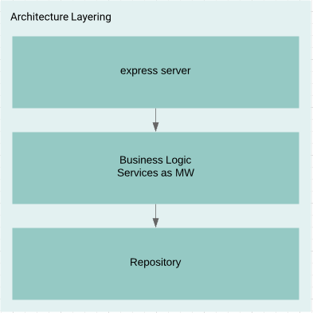
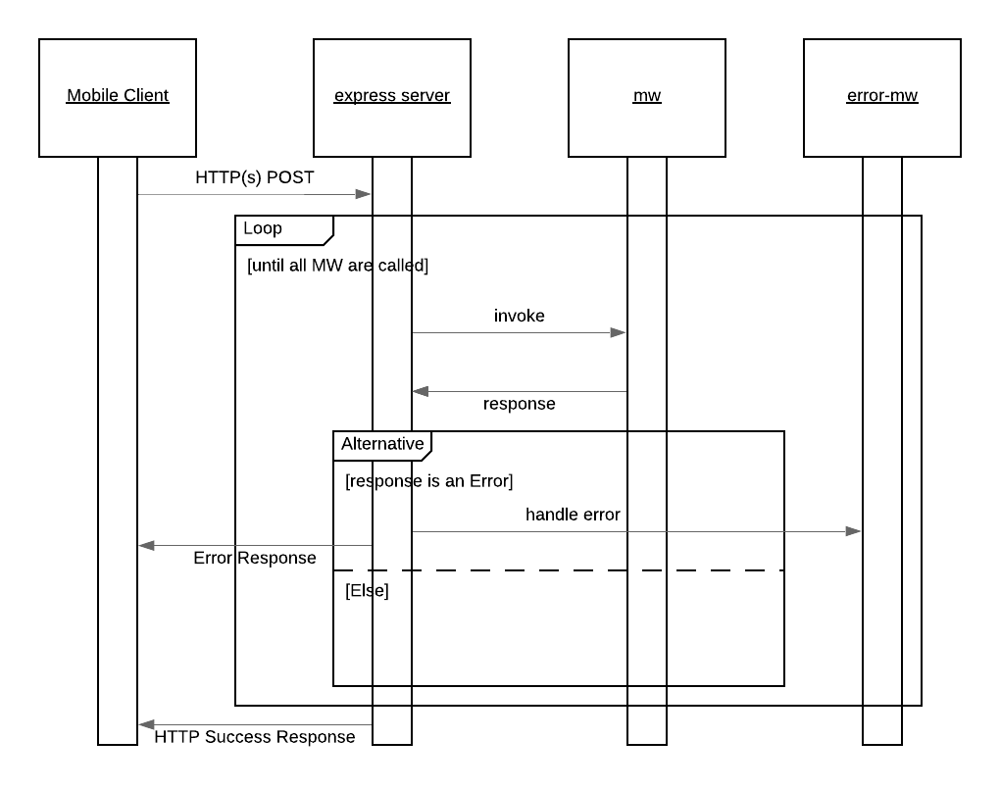

# profile-services

This repo contains a set of deployable services to handle BookIt User Profile Operations. The repo is designed as a mono-repo to house all services necessary to support a profile as it has been defined for the BookIt app. Each service is intended to be individually deployed as a standalone microservice to the cloud to be consumed by the client applications.

## Content

- [High Level Architecture](#High-Level-Architecture)
- [Design](#Design)
- [Data Model](#Data-Model)
- [Component Descriptions](#Component-Descriptions)
  - [Shared lib](#Shared-Lib)
  - [Create Profile Service](#create-profile-service)
  - [Update Profile Service](#update-profile-service)
  - [Query Profile Service](#query-profile-service)
  - [Delete Profile Service](#delete-profile-service)
  - [Provider Create/Delete Notification Processors](#provider-notification-processors)
- [REST APIs](#REST-APIs)
- [Repo Organization](#Repository-Organization)
- [Code Quality](#Code-Quality)

## High Level Architecture

The overall design of the services is based on the layering shown in the above diagram. There is an express server which exposes routes accessible via HTTP. Each route has a set of Business logic attached which are defined as express MW allowing the logic to be re-used where appropriate and decomposed/isolated with clear separation of concerns. Finally there is a data access layer defined as the Repository layer where all interactions with the underlying storage technology is abstracted.

## Design

The design is based around how [expressjs](https://expressjs.com) works and hence everything is essentially decomposed down into a setup of middleware. The following describes each component of the diagram in more detail.

## Data Model

The data model supporting the profile set of services is represented in the diagram above and the collection is stored within Cloud Firestore. The entirety of the information is contained within a single document per profile. All of the services within this repo work with this underlying data model and operate on different parts/subsets of the data depending on the services responsibility. The below provides details related to the purpose of the collection.

- profile collection: This collection contains documents pertaining to the profile Master Data like the name, address, and user preferences that are used as defaults within the client application.

## REST APIs

Each service depicted in the design diagram exposes HTTP(s) REST APIs to be consumed by either the client application, other internal Google Cloud Services, or for service to service internal API communication. The requests that are exposed are found within the component descriptions of the [Design](#Design). Additionally, refer to the [API Gateway Repo](https://github.com/bookit-app/api-gateway) OpenAPI specification for the APIs which are exposed and consumed from the client application (Outside of the GCP Infrastructure).

The services defined within this repo generate REST endpoints as follows:

- [POST /profile](https://endpointsportal.bookit-app-260021.cloud.goog/docs/esp-fjwomrdjca-ue.a.run.app/0/routes/profile/post): To enable a profile to be created. Refer to the [schema](./src/services/create-profile/src/payload-validations.js) for details on the expected payload
- [GET /profile](https://endpointsportal.bookit-app-260021.cloud.goog/docs/esp-fjwomrdjca-ue.a.run.app/0/routes/profile/%7BprofileId%7D/get): To enable a specific profile to be retrieved based on the logged in user
- **GET /admin/profiles**: To enable a specific profile to be retrieved for internal service to service communication. This an internal API only and not exposed to the outside world.
- [PATCH /profile](https://endpointsportal.bookit-app-260021.cloud.goog/docs/esp-fjwomrdjca-ue.a.run.app/0/routes/profile/patch): To enable a specific profile to be updated. Refer to the [schema](./src/services/update-profile/src/payload-validations.js) for details on the expected payload
- [DELETE /profile](https://endpointsportal.bookit-app-260021.cloud.goog/docs/esp-fjwomrdjca-ue.a.run.app/0/routes/profile/%7BprofileId%7D/delete): To enable a specific profile to be delete

## Component Descriptions

### Shared lib

The items within the section make up a set of components (functions, classes, data) which are intended to be shared/reused across all services pertaining to the profile-services.

- **express mw**: Common middleware used essentially on every route exposed via the services

  - **error-handling-mw**: This is the mw which is hooked into express to take of errors when they are raised. The MW takes the error generated and populates a default JSON object to be returned to the call and also sets the HTTP status code appropriately
  - **user-mw**: This is a mw which is hooked into express and handles processing the HTTP header injected by Google Cloud Endpoints which contains the Base64 encoded user metadata. The MW will take the Base64 data, decode it and place it into a req object attribute to allow the information to be passed along to other MW steps which required it. This ensures that we only need to decode the data one time. If the MW doesn't find this header it raises a ServiceError to ensure that the processing of teh request is stopped
  - **payload-validation-mw**: This middleware is a re-usable MW which can allow the services to hook in JSON payload validations. The MW makes use of a library called [ajv](https://ajv.js.org) and will automatically validation the body of the HTTP request based on the provided schema.
  - **trace-id-mw**: This middleware is responsible to make the Trace ID information which is injected by Google Cloud automatically into the HTTP headers and make it available for use in other locations of the express chain when logs are being generated.

- **repository**: Contains components acting as the data access layer for the services

  - **firestore**: Provides access to the `@google-cloud/firestore` module within the node js applications
  - **profile-repository**: Provides functions to interact with the profiles firestore collections and documents.

- **util**: Provides a setup of utility type components for the services to rely on

  - **ServiceError**: this is an extension to the default JS Error object to allow specific information like errorCodes and http status codes to be propagated to the error-handling-mw when an error occurs.
  - **validator**: Provides the AJV object reference to the node application and is primarily used by the payload-validation-mw

- **constants**: Exposes a set of attributes as constants for use across the services.
  - **errors**: Constants represented general error situations and are intended to be used as the basis for errors created into the ServiceError reference
  - **statusCodes**: This is a reference to an npm modules calls `http-status-codes` which provides contsants for the HTTP Status Codes like 200, 201, 500, etc

### create-profile-service

The create profile service exposes a route to **POST** profiles. When a request is received it will trigger a set of express MW and determine what to do. The service exposes the route at `/profile`. This route is configured with the middleware as described within the [create-profile-service index.js](./src/services/create-profile/src/index.js) file.

- **service specific express MW**: Contains express MW which is dedicated to the create profile service

  - **create-profile-mw**: Assumes that all data validations and requirements to allow for creating a profile have been achieved, which is ensured via the configuration of the express route. It is essentially a wrapper around the profile-repository create function to trigger the commit of the profile data into cloud firestore.
  - **success-mw**: Triggered as the last MW in the chain and if triggered means that everything was fine and the profile was successfully created. This MW just sends an HTTP 201 status code back to the consumer.

- **payload-validations**: This contains the Payload JSON Schema definition which is provided to the **payload-validation-mw** to verify that the body of the HTTP request is correct.

### update-profile-service

The update profile service exposes a route to **PATCH** profiles. When a request is received it will trigger a set of express MW and determine what to do. The service exposes the route at `/profile`. This route is configured with the middleware as described within the [update-profile-service index.js](./src/services/update-profile/src/index.js) file.

- **service specific express MW**: Contains express MW which is dedicated to the create profile service

  - **update-profile-mw**: Assumes that all data validations and requirements to allow for updating a profile have been achieved, which is ensured via the configuration of the express route. It is essentially a wrapper around the profile-repository update function to trigger the commit of the profile data into cloud firestore. The updates will be merged into the existing profile so ONLY those fields which are provided will be modified
  - **success-mw**: Triggered as the last MW in the chain and if triggered means that everything was fine and the profile was successfully updated. This MW just sends an HTTP 200 status code back to the consumer.

- **payload-validations**: This contains the Payload JSON Schema definition which is provided to the **payload-validation-mw** to verify that the body of the HTTP request is correct.

### query-profile-service

The query profile service exposes a route to **GET** a the profile associated with the current user. When a request is received it will trigger a set of express MW and determine what to do. The service exposes the route at `/profile`. This route is configured with the middleware as described within the [query-profile-service index.js](./src/services/query-profile/src/index.js) file.

- **service specific express MW**: Contains express MW which is dedicated to the create profile service

  - **query-profile-mw**: Assumes that all data validations and requirements to allow for querying a profile have been achieved, which is ensured via the configuration of the express route. It is essentially a wrapper around the profile-repository query function to trigger the request of the profile data from cloud firestore. Additionally, a consumer can request specific subsets of data from the profile by providing the `select` query option.
  - **query-options-mw**: This MW extracts and validates the query parameters provides in the `select` options.

### delete-profile-service

The delete profile service exposes a route to **DELETE** profiles. When a request is received it will trigger a set of express MW and determine what to do. The service exposes the route at `/profile`. This route is configured with the middleware as described within the [delete-profile-service index.js](./src/services/delete-profile/src/index.js) file.

- **service specific express MW**: Contains express MW which is dedicated to the create profile service

  - **delete-profile-mw**: Assumes that all data validations and requirements to allow for deleting a profile have been achieved, which is ensured via the configuration of the express route. It is essentially a wrapper around the profile-repository delete function to trigger the removal of the profile data from cloud firestore.
  - **query-profile-mw**: When deleting a profile we verify that it exists prior to attempting a delete. This MW will verify that the profile for the logged in user exists and if so allow the MW chain to continue. Otherwise it will generate a 404 response.
  - **success-mw**: Triggered as the last MW in the chain and if triggered means that everything was fine and the profile was successfully deleted. This MW just sends and HTTP 204 status code back to the consumer.

### provider-notification-processors

The profile services are interested to know when service providers are created and or deleted as they flag the profiles with specific information to note the the profile is related to a service provider. In order to do this the services:

- [provider-create-notification-processor](./src/services/provider-create-notification-processor): Listens to Cloud PubSub topic provider-create-notification
- [provider-delete-notification-processor](./src/services/provider-delete-notification-processor): Listens to the Cloud PubSub topic provider-delete-notification

Are implemented and deployed to Cloud Run in order to listen for these events and mark or de-mark the associated users profile.

## Repository Organization

As these services are all implemented in nodejs npm is used to manage the dependencies. However, as this is a mono-repo and contains several microservice applications that will be deployed as docker containers it has been designed in a away to allow each service to be built into a container containing only the necessary dependencies that it specifically requires. This is done to try and keep the image size to a minimum. Dependencies are managed as follows:

- **Global Dependencies**: There are dependencies that every service leverages. These have been defined in the `package.json` at the root of the project and each service leverages them as this ensures consistency across the deployments as well as ensures that shared libraries leverage the same versions across all.
- **Local Dependencies**: These are dependencies specific to an individual service and would only be contained within the deployment. These are managed within the `package.json` file within the services directory under src/service/<service-name>.

## Code Quality

The following practices were put in place to ensure high quality code is delivered:

- Integration with husky inorder to verify what is being pushed and committed to github. Husky is a tool that plugs into local git hooks and we leverage it for processing verifications as pre-commit hooks. For the profile-services hooks are in place to ensure for unit-tests pass, code coverage is acceptable, and linting is enforced (code syntax, formatting, etc) on commit. The settings are defined within the main [package.json](./package.json)

- We have enforced a code review processing within github using the Pull Request process. When pull requests are opened the following occurs:
  - Integration with [Coveralls](https://coveralls.io/github/bookit-app/profile-services?branch=master) to track unit test code coverage over time to ensure we can tracking well with our implemented unit tests - Also see badge linked at the top of the repo
  - Integration with [Codacy](https://www.codacy.com/gh/bookit-app/profile-services?utm_source=github.com&utm_medium=referral&utm_content=bookit-app/profile-services&utm_campaign=Badge_Grade) which is a code quality tool and provides insights in to overall code quality based on a scoring metric, analyzes complexity, technical debt, formatting issues and so one. - Also see badge linked at the top of the repo
  - Build validation is performed where linting, and unit tests are executed agin to ensure everything is still passing
  - If the above checks do not meet standards set for the project and pass than the pull request cannot be merged into the master branch. This alleviates that we have undesirable code being merged onto the master branch and deployed to the production landscape
